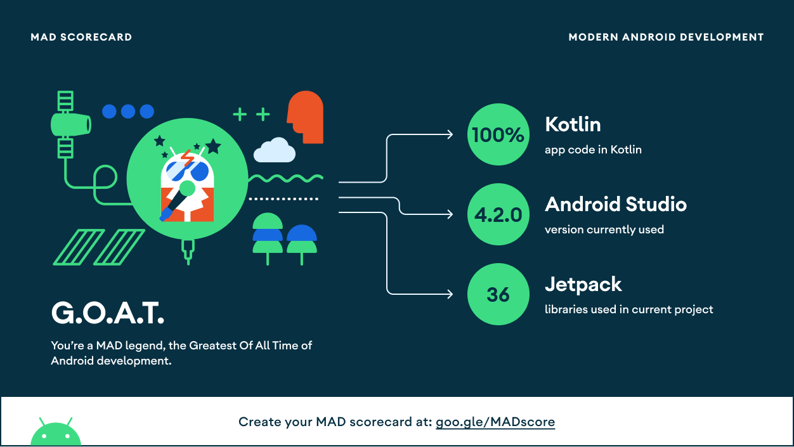
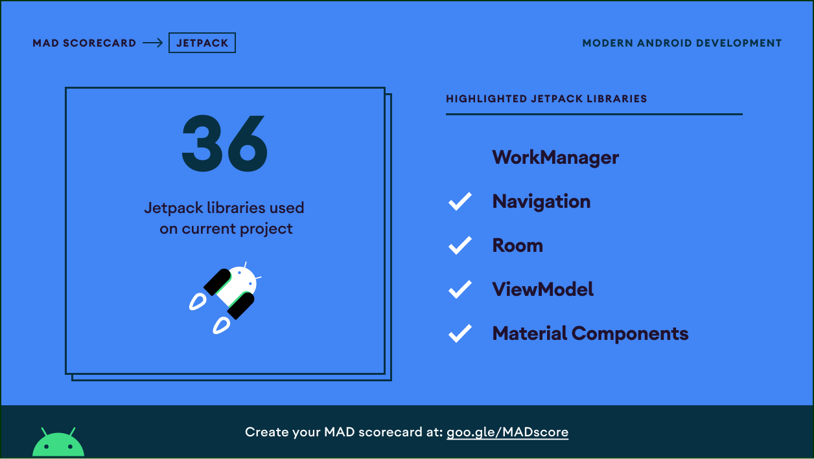
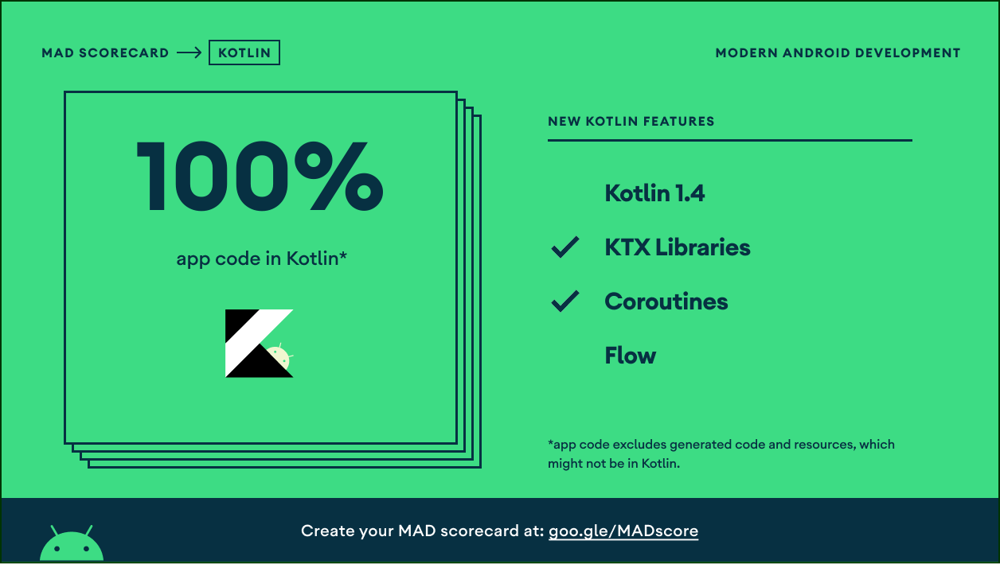

# FavMovies
## Features
The goal of the project is to combine popular libraries/tools and demonstrate best developement practices and presenting modern Android application Architecture that is modular, scalable, maintainable, and testable.

The project contains three moduls including app module, data module and domain module. Currently the following features are implemented : 

- Clean Architecture  
- Dependency Injection with dagger-hilt  
- Coroutines  
- Room library  
- Android Architecture components   

I am going to add junit and use workmanager to it.

## Demo

## MAD SCORECARD

